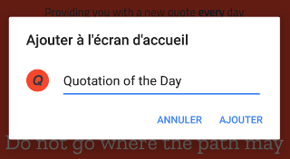
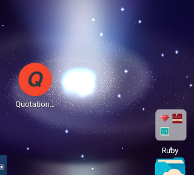
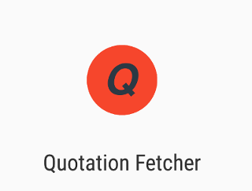

## Quote of the Dday
### Inspiration
I just wanted to do this challenge on the [Free Code Camp](https://www.freecodecamp.org/challenges/build-a-random-quote-machine)

### A few words on the workflow

Simple design with Twitter Bootstrap and Google fonts. For CSS I used PostCSS with Gulp.
The quotes are retrieved via a simple Ajax request to the free API of [Quotes on Design](http://quotesondesign.com)

Made this to get a true mobile first design up and running here. The only update I still want to make is when I know how to hide the browser statusbar :-P

http://www.etbim.de/quote/

#### Mobile first progressive web app
The project makes full use of [Google's guidelines](https://developers.google.com/web/fundamentals/native-hardware/fullscreen/) for designing a website as a progressive web app. There is a manifest.json file and you can add the app to your home screen.

Adding the app to the homescreen

The progressive web app starts like a normal app in full screen mode

